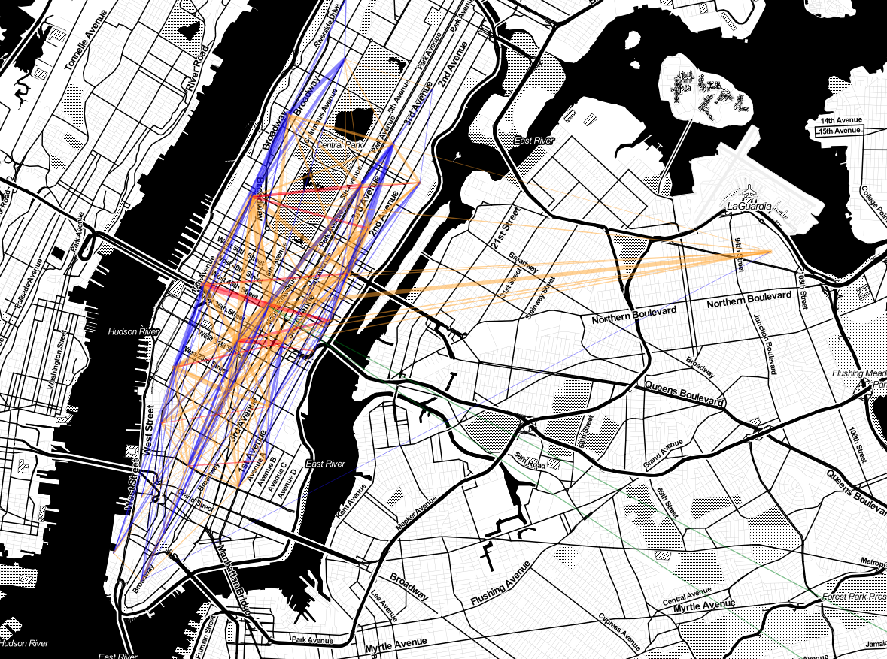
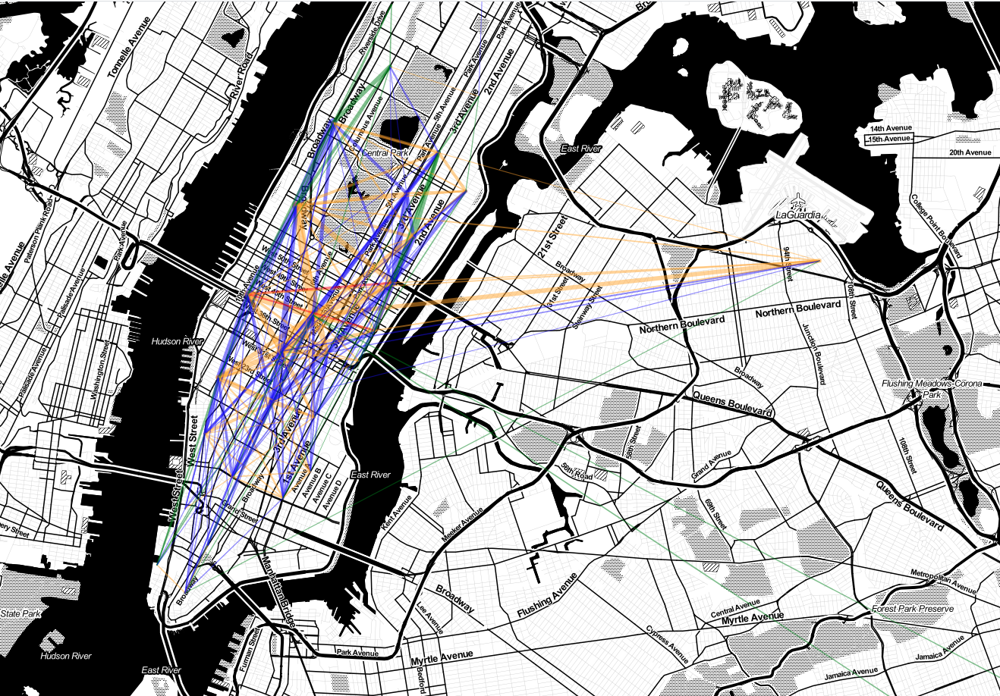
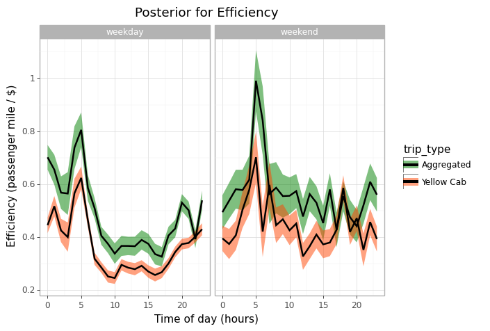

# NYC Yellow Cab Efficiency 
---
> Independent project to explore the impact of shared rides on the efficiency of NYC transit by using trip aggregation strategies on NYC Yellow Cab trip data. I provide an estimate of gained efficiency if we switch from traditional yellow cab rides to aggressive ride sharing strategies. My approach starts by defining an efficiency metric and an aggregation strategy and then I compare the distribution of efficiency of yellow cabs and ride shares across a range of spatial and temporal gradients within Manhattan.

## Highlights
1. Custom-designed (very) comprehensive efficiency measurement for means of transportation that takes into account passenger displacement, driver salary, passenger opportunity-cost, fuel cost (in movement and idle) and carbon emissions.
2. Even without taking extra passengers midway or account for an improved traffic, 6 passenger mini-vans with an aggressive share ride strategy vastly outperforms NYC yellow cabs using the provided efficiency metric.
3. Depending on routes, bikes are still more efficient than shared-rides and yellow cabs barely beat walkers at 3.6 km/hr.
4. Differences between yellow cabs and shared rides are consistent across all times and all days of the week.

NYC traffic data available at their website or within Google BigQuery (notebook contains code for reading from bigquery)

## Contents:
1. Shapefiles with NYC borough boundaries and borough names.
2. Jupyter notebook with the entire EDA pipeline (also available as an html file with preprocessed outputs).
3. Plots summarizing comparison between yellow cab rides and aggregated rides.
4. Conda environment with all required packaged to reproduce the analysis.

---
## Instructions to reproduce :
1. install conda environment

``
conda env create -y yellowcab.yml   
``

2. open the notebook

``
jupyter notebook   
``

3. select the correct kernel 
   
4. swap in your google bigquery project string id 
   
5. run all cells!

*Feel free to change the date range but beware the volume of data, I am using two weeks here and am already on the gigabyte zone.*

*Depending on how good your CPU is, this can take quite a while, I an '.html' file with preprocessed outputs in the repo for convenience.*

---
## Efficiency formula

*for further details about the formula and my assumptions, see the notebook.*

## Traffic maps preview

### Yellow cabs

### Shared rides

*Red lines are comparable to walkers when it comes to efficiency and green lines are comparable to bicycles.*

*Interactive versions of these maps are available in the notebook and its html version.*

## Efficiency through time

